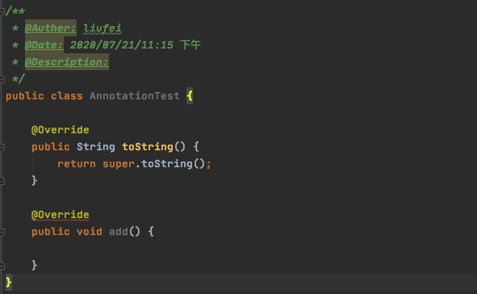
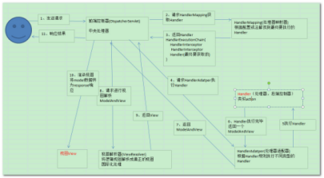

# Spring的核心内容

<!-- toc -->

## spring的IOC

IOC（inverse of control）：控制反转 ，将对象创建的控制权交给IOC容器，应用程序中用到对象时，再从容器中获得。还有一个更确切的名字叫做DI（dependency injection）依赖注入，创建对象时根据对象之间的依赖关系根据配置自动注入依赖对象。

 

**依赖注入的三种方式：**

（1）构造方法注入：即被注入对象可以通过在其构造方法中声明依赖对象的参数列表，让外部（通常是IOC容器）知道它需要哪些依赖对象，然后IOC容器会检查被注入对象的构造方法。

（2）setter方法注入：即当前对象只需要为其依赖对象所对应的属性添加setter方法，IOC容器通过此setter方法将相应的依赖对象设置到被注入对象的方式即setter方法注入。

（3）接口注入：接口注入有点复杂，被注入对象如果想要IOC容器为其注入依赖对象，就必须实现某个接口，这个接口提供一个方法，用来为被注入对象注入依赖对象，IOC容器通过接口方法将依赖对象注入到被注入对象中去。相对于前两种注入方式，接口注入比繁琐和死板，被注入对象就必须专声明和实现另外的接口。

 

默认情况下,IOC容器中创建的对象都是单列对象

bean标签上添加scope=”prototype”设置非单例对象。

 

***默认情况下，创建容器对象时，会自动创建容器中的对象***。单例的并且非懒加载对象（饿汉式，用不用先创建放在那）。只有在第一次从容器中获得该对象，才会创建。

## spring的AOP

### 什么是AOP？

**AOP**：Aspect Oriented Programming 面向切面编程。
**面向切面编程(也叫面向方面)**：Aspect Oriented Programming(AOP),是目前软件开发中的一个热点。利用AOP可以对业务逻辑的各个部分进行隔离，从而使得业务逻辑各部分之间的耦合度降低，提高程序的可重用性，同时提高了开发的效率。

> AOP是OOP的延续，是（Aspect Oriented Programming）的缩写，意思是面向切面（方面）编程。
> 主要的功能是：***\*日志记录，性能统计，安全控制，事务处理，异常处理\****等等。
> 主要的意图是：将日志记录，性能统计，安全控制，事务处理，异常处理等代码从业务逻辑代码中划分出来，通过对这些行为的分离，我们希望可以将它们独立到非指导业务逻辑的方法中，进而改变这些行为的时候不影响业务逻辑的代码。

> 可以通过预编译方式和运行期动态代理实现在不修改源代码的情况下给程序动态统一添加功能的一种技术。AOP实际是GoF设计模式的延续，设计模式孜孜不倦追求的是调用者和被调用者之间的解耦，AOP可以说也是这种目标的一种实现。
>
> 假设把应用程序想成一个立体结构的话，OOP的利刃是纵向切入系统，把系统划分为很多个模块（如：用户模块，文章模块等等），而AOP的利刃是横向切入系统，提取各个模块可能都要重复操作的部分（如：权限检查，日志记录等等）。由此可见，AOP是OOP的一个有效补充。
>
> 注意：AOP不是一种技术，实际上是编程思想。凡是符合AOP思想的技术，都可以看成是AOP的实现。

#### 关注点

关注点：重复代码就叫做关注点；

#### 切面

关注点形成的类，就叫切面(类)！

面向切面编程，就是指 对很多功能都有的重复的代码抽取，在运行的时候往业务方法上动态植入“切面类代码”。

#### 切入点

执行目标对象方法，动态植入切面代码。

可以通过切入点表达式，指定拦截哪些类的哪些方法； 给指定的类在运行的时候植入切面类代码。

### AOP底层的实现原理

静态代理和动态代理

静态代理需要生成目标代理对象---不推荐

动态代理是不需要生成目标代理对象的

动态代理分为jdk动态代理和cglib

jdk需要接口，动态dialing只需要自雷实现，基于java的反射

cglib是基于ASM字节码包装的一个类库。

ASM字节码：

> ASM是一个java字节码操纵框架，它能被用来动态生成类或者增强既有类的功能。ASM 可以直接产生二进制 class 文件，也可以在类被加载入 Java 虚拟机之前动态改变类行为。Java class 被存储在严格格式定义的 .class文件里，这些类文件拥有足够的元数据来解析类中的所有元素：类名称、方法、属性以及 Java 字节码（指令）。ASM从类文件中读入信息后，能够改变类行为，分析类信息，甚至能够根据用户要求生成新类。asm字节码增强技术主要是用来反射的时候提升性能的，如果单纯用jdk的反射调用，性能是非常低下的，而使用字节码增强技术后反射调用的时间已经基本可以与直接调用相当了

#### 什么是代理？

通过代理控制对象的访问,可以详细访问某个对象的方法，在这个方法调用处理，或调用后处理。既(AOP微实现) ,AOP核心技术面向切面编程。

**应用场景：**

SpringAOP、事物原理、日志打印、权限控制、远程调用、安全代理 可以隐蔽真实角色

#### 静态代理

由程序员创建或工具生成代理类的源码，再编译代理类。**所谓静态代理也就是在程序运行前就已经存在代理类的字节码文件，代理类和委托类的关系在运行前就确定了。**

传统的方式：

```java
public interface UserService {
    void add();
}
```

```java
public class UserServiceImpl implements UserService {
    public void add() {
        System.out.println("开启事务");
        System.out.println("添加数据");
        System.out.println("关闭事务");
    }
}
```

```java
public class Main {
    public static void main(String[] args) {
        UserService userService = new UserServiceImpl();
        userService.add();
    }
}
```

> 缺点：
>
> - 每个方法中都需要加上开启事务和关闭事务，代码重复较多，维护起来麻烦

使用静态代理？

```java
public interface UserService {
    void add();
}
```

```java
public class UserServiceImpl implements UserService {
    public void add() {
        System.out.println("添加数据");
    }
}
```

```java
// 使用静态代理
public class UserServiceProxy implements UserService{

    // 目标对象
    private UserService target;

    public UserServiceProxy (UserService userService) {
        this.target = userService;
    }

    public void add() {
        System.out.println("开启事务");
        target.add();
        System.out.println("结束事务");
    }
}
```

```java
public class Main {
    public static void main(String[] args) {
        UserService userService = new UserServiceImpl();
        UserServiceProxy proxy = new UserServiceProxy(userService);
        proxy.add();
    }
}
```

> 静态代理的缺点是：
>
> 1. 针对每一个被代理类都需要创建一个代理对象
> 2. 代理类和委托类实现相同的接口。

#### 动态代理

1.代理对象,不需要实现接口

2.代理对象的生成,是利用JDK的API,动态的在内存中构建代理对象(需要我们指定创建代理对象/目标对象实现的接口的类型)

3.动态代理也叫做:JDK代理,接口代理

##### JDK动态代理

1)	原理：是根据类加载器和接口创建代理类（此代理类是接口的实现类，所以必须使用接口 面向接口生成代理，位于java.lang.reflect包下） 

2)	实现方式： 

> 1. 通过实现InvocationHandler接口创建自己的调用处理器 IvocationHandler handler = new InvocationHandlerImpl(…); 
>
> 2. 通过为Proxy类指定ClassLoader对象和一组interface创建动态代理类Class clazz = Proxy.getProxyClass(classLoader,new Class[]{…}); 
>
> 3. 通过反射机制获取动态代理类的构造函数，其参数类型是调用处理器接口类型Constructor constructor = clazz.getConstructor(new Class[]{InvocationHandler.class}); 
>
> 4. 通过构造函数创建代理类实例，此时需将调用处理器对象作为参数被传入Interface Proxy = (Interface)constructor.newInstance(new Object[] (handler));

缺点：jdk动态代理，必须是面向接口的，目标代理类必须实现接口。

```java
public class InvocationHandlerImpl implements InvocationHandler {

    private Object target;

    public InvocationHandlerImpl(Object target) {
        this.target = target;
    }

    public Object invoke(Object proxy, Method method, Object[] args) throws Throwable {
        System.out.println("--- jdk动态代理：开启事务 ---");
        Object invoke = method.invoke(target, args);
        System.out.println("--- jdk动态代理：关闭事务 ---");
        return invoke;
    }

    public static void main(String[] args) {
        UserService userService = new UserServiceImpl();
        InvocationHandlerImpl handler = new InvocationHandlerImpl(userService);
        ClassLoader classLoader = userService.getClass().getClassLoader();
        Class<?>[] interfaces = userService.getClass().getInterfaces();
        UserService proxyInstance = (UserService) Proxy.newProxyInstance(classLoader, interfaces, handler);
        proxyInstance.add();
    }
}
```

##### CGLIB代理

原理：利用asm开源包，对代理对象类的class文件加载进来，通过修改其字节码生成子类来处理。 

**使用cglib[Code Generation Library]实现动态代理，并不要求委托类必须实现接口，底层采用asm字节码生成框架生成代理类的字节码**

```xml
<dependency>
  <groupId>cglib</groupId>
  <artifactId>cglib</artifactId>
  <version>3.3.0</version>
</dependency>
```

```java
public class CglibProxy implements MethodInterceptor {

    private Object target;

    public Object getInstance(Object target) {
        this.target = target;
        Enhancer enhancer = new Enhancer();
        enhancer.setSuperclass(target.getClass());
        enhancer.setCallback(this);
        return enhancer.create();
    }

    public Object intercept(Object o, Method method, Object[] objects, MethodProxy methodProxy) throws Throwable {
        System.out.println("--- cglib 开启事务 ---");
        Object invoke = methodProxy.invoke(target, objects);
        System.out.println("--- cglib 关闭事务 ---");
        return invoke;
    }

    public static void main(String[] args) {
        CglibProxy cglibProxy = new CglibProxy();
        UserService userService = (UserService) cglibProxy.getInstance(new UserServiceImpl());
        userService.add();
    }
}
```

#### CGLIB动态动态区别

java动态代理是利用反射机制生成一个实现代理接口的匿名类，在调用具体方法前调用InvokeHandler来处理。

而cglib动态代理是利用asm开源包，对代理对象类的class文件加载进来，通过修改其字节码生成子类来处理。

Spring中。

1、如果目标对象实现了接口，默认情况下会采用JDK的动态代理实现AOP 

2、如果目标对象实现了接口，可以强制使用CGLIB实现AOP 

3、如果目标对象没有实现了接口，必须采用CGLIB库，spring会自动在JDK动态代理和CGLIB之间转换

JDK动态代理只能对实现了接口的类生成代理，而不能针对类 。
CGLIB是针对类实现代理，主要是对指定的类生成一个子类，覆盖其中的方法 。
因为是继承，所以该类或方法最好不要声明成final ，final可以阻止继承和多态。

### AOP编程使用

```xml
<dependency>
			<groupId>org.springframework</groupId>
			<artifactId>spring-core</artifactId>
			<version>3.0.6.RELEASE</version>
		</dependency>
		<dependency>
			<groupId>org.springframework</groupId>
			<artifactId>spring-context</artifactId>
			<version>3.0.6.RELEASE</version>
		</dependency>
		<dependency>
			<groupId>org.springframework</groupId>
			<artifactId>spring-aop</artifactId>
			<version>3.0.6.RELEASE</version>
		</dependency>
		<dependency>
			<groupId>org.springframework</groupId>
			<artifactId>spring-orm</artifactId>
			<version>3.0.6.RELEASE</version>
		</dependency>
		<dependency>
			<groupId>org.aspectj</groupId>
			<artifactId>aspectjrt</artifactId>
			<version>1.6.1</version>
		</dependency>
		<dependency>
			<groupId>aspectj</groupId>
			<artifactId>aspectjweaver</artifactId>
			<version>1.5.3</version>
		</dependency>
```

```xml
<?xml version="1.0" encoding="UTF-8"?>
<beans xmlns="http://www.springframework.org/schema/beans"
	xmlns:xsi="http://www.w3.org/2001/XMLSchema-instance" xmlns:p="http://www.springframework.org/schema/p"
	xmlns:context="http://www.springframework.org/schema/context"
	xmlns:aop="http://www.springframework.org/schema/aop"
	xsi:schemaLocation="
        http://www.springframework.org/schema/beans
        http://www.springframework.org/schema/beans/spring-beans.xsd
        http://www.springframework.org/schema/context
        http://www.springframework.org/schema/context/spring-context.xsd
        http://www.springframework.org/schema/aop
        http://www.springframework.org/schema/aop/spring-aop.xsd">
	<context:component-scan base-package="com.liufei"></context:component-scan>
	<aop:aspectj-autoproxy></aop:aspectj-autoproxy> <!-- 开启事物注解 -->
</beans>

```

因为这用的不是springboot项目，所以加上配置文件

##### 注解版本：

```java
// 切面类
@Component
@Aspect
public class AopLog {

    // aop中的通知，前置通知，后置通知，运行通知，异常通知，环绕通知
    @Before("execution(* com.liufei.spring.service.UserService.add(..))")
    public void before() {
        System.out.println("前置通知");
    }

    @After("execution(* com.liufei.spring.service.UserService.add(..))")
    public void after() {
        System.out.println("后置通知");
    }

    @AfterReturning("execution(* com.liufei.spring.service.UserService.add(..))")
    public void afterReturning() {
        System.out.println("运行通知");
    }

    @AfterThrowing("execution(* com.liufei.spring.service.UserService.add(..))")
    public void afterThrowing() {
        System.out.println("异常通知");
    }

    @Around("execution(* com.liufei.spring.service.UserService.add(..))")
    public void around(ProceedingJoinPoint point) throws Throwable {
        System.out.println("环绕前通知");
        // 这里如果跑出异常，不会走下面的
        point.proceed();
        System.out.println("环绕后通知");
    }
}
```

```java
public class AopMain {
    public static void main(String[] args) {
        ClassPathXmlApplicationContext applicationContext = new ClassPathXmlApplicationContext("spring.xml");
      	// 注意：UserServiceImp这个类要加上@Service
        UserService userService = (UserService) applicationContext.getBean("userServiceImpl");
        userService.add();
    }
}
```

```java
// 结果
环绕前通知
前置通知
添加数据
环绕后通知
运行结束后通知
后置通知
```

> 注意：
>
> 1. 因为现在没有抛出异常，所以异常通知没有执行。
>
> 2. 当add()方法有异常，并且没有捕获时。
>
>    > 环绕前通知;
>    > 前置通知;
>    > 异常通知;
>    > 后置通知;
>
> 3. 如果add()方法中捕获了

##### XML版本

```xml
 <!-- service 实例 -->
	<bean id="userService" class="com.liufei.spring.service.impl.UserServiceImpl"/>
	<!-- 切面类 -->
	<bean id="aop" class="com.itmayiedu.aop2.AopLog2"></bean>
	<!-- Aop配置 -->
	<aop:config>
		<!-- 定义一个切入点表达式： 拦截哪些方法 -->
		<aop:pointcut expression="execution(* com.itmayiedu.service.UserService.*(..))"
			id="pt" />
		<!-- 切面 -->
		<aop:aspect ref="aop">
			<!-- 环绕通知 -->
			<aop:around method="around" pointcut-ref="pt" />
			<!-- 前置通知： 在目标方法调用前执行 -->
			<aop:before method="begin" pointcut-ref="pt" />
			<!-- 后置通知： -->
			<aop:after method="after" pointcut-ref="pt" />
			<!-- 返回后通知 -->
			<aop:after-returning method="afterReturning"
				pointcut-ref="pt" />
			<!-- 异常通知 -->
			<aop:after-throwing method="afterThrowing"
				pointcut-ref="pt" />
		</aop:aspect>
	</aop:config>
```

注意：

UserService接口和UserServiceImpl实现类都不需要加上任何注解。

```java
public class Aop2Main {
    public static void main(String[] args) {
        BeanFactory applicationContext = new ClassPathXmlApplicationContext("spring.xml");
        UserService userService = (UserService) applicationContext.getBean("userService");
        userService.add();
    }
}
```

### Spring事务使用

##### 事务基本特征

**（1）原子性（Atomicity）**

​		原子性是指事务包含的所有操作要么全部成功，要么全部失败回滚，因此事务的操作如果成功就必须要完全应用到数据库，如果操作失败则不能对数据库有任何影响。

**（2）一致性（Consistency）**

​		一致性是指事务必须使数据库从一个一致性状态变换到另一个一致性状态，也就是说一个事务执行之前和执行之后都必须处于一致性状态。

　　拿转账来说，假设用户A和用户B两者的钱加起来一共是5000，那么不管A和B之间如何转账，转几次账，事务结束后两个用户的钱相加起来应该还得是5000，这就是事务的一致性。

**（3）隔离性（Isolation）**

​		隔离性是当多个用户并发访问数据库时，比如操作同一张表时，数据库为每一个用户开启的事务，不能被其他事务的操作所干扰，多个并发事务之间要相互隔离。

　　即要达到这么一种效果：对于任意两个并发的事务T1和T2，在事务T1看来，T2要么在T1开始之前就已经结束，要么在T1结束之后才开始，这样每个事务都感觉不到有其他事务在并发地执行。

　　关于事务的隔离性数据库提供了多种隔离级别，稍后会介绍到。

**（4）持久性（Durability）**

​		持久性是指一个事务一旦被提交了，那么对数据库中的数据的改变就是永久性的，即便是在数据库系统遇到故障的情况下也不会丢失提交事务的操作。

​		例如我们在使用JDBC操作数据库时，在提交事务方法后，提示用户事务操作完成，当我们程序执行完成直到看到提示后，就可以认定事务以及正确提交，即使这时候数据库出现了问题，也必须要将我们的事务完全执行完成，否则就会造成我们看到提示事务处理完毕，但是数据库因为故障而没有执行事务的重大错误。

##### 事务控制的分类：

编程式事务

> 自己手动控制事务，就叫做编程式事务控制。
>
> ​	Jdbc代码：
>
> ​		Conn.setAutoCommite(false);  // 设置手动控制事务
>
> ​	Hibernate代码：
>
> ​		Session.beginTransaction();   // 开启一个事务
>
> ​	【细粒度的事务控制： 可以对指定的方法、指定的方法的某几行添加事务控制】
>
> ​	(比较灵活，但开发起来比较繁琐： 每次都要开启、提交、回滚.)

声明式事务

> Spring提供了对事务的管理, 这个就叫声明式事务管理。
>
> ​	Spring提供了对事务控制的实现。用户如果想用Spring的声明式事务管理，只需要在配置文件中配置即可； 不想使用时直接移除配置。这个实现了对事务控制的最大程度的解耦。
>
> ​	Spring声明式事务管理，核心实现就是基于Aop。
>
> ​	【粗粒度的事务控制： 只能给整个方法应用事务，不可以对方法的某几行应用事务。】
>
> ​	(因为aop拦截的是方法。)
>
>  
>
> ​	Spring声明式事务管理器类：
>
> ​	Jdbc技术：DataSourceTransactionManager
>
> ​	Hibernate技术：HibernateTransactionManager

## 手写Spring的事务框架

连接数据库了，加上下面两个依赖

```xml
<dependency>
  <groupId>com.mchange</groupId>
  <artifactId>c3p0</artifactId>
  <version>0.9.5.2</version>
</dependency>
<dependency>
  <groupId>mysql</groupId>
  <artifactId>mysql-connector-java</artifactId>
  <version>5.1.37</version>
</dependency>
```

```xml
<!-- 1. 数据源对象: C3P0连接池 -->
	<bean id="dataSource" class="com.mchange.v2.c3p0.ComboPooledDataSource">
		<property name="driverClass" value="com.mysql.jdbc.Driver"></property>
		<property name="jdbcUrl" value="jdbc:mysql://localhost:3306/test"></property>
		<property name="user" value="root"></property>
		<property name="password" value="123456"></property>
	</bean>

	<!-- 2. JdbcTemplate工具类实例 -->
	<bean id="jdbcTemplate" class="org.springframework.jdbc.core.JdbcTemplate">
		<property name="dataSource" ref="dataSource"></property>
	</bean>

	<!-- 3.配置事务 -->
	<bean id="dataSourceTransactionManager"
		class="org.springframework.jdbc.datasource.DataSourceTransactionManager">
		<property name="dataSource" ref="dataSource"></property>
	</bean>
```

写个事务提交回滚的工具类

```java
@Component
public class TransactionUtils {

	@Autowired
	private DataSourceTransactionManager dataSourceTransactionManager;

	// 开启事务
	public TransactionStatus begin() {
		TransactionStatus transaction = dataSourceTransactionManager.getTransaction(new DefaultTransactionAttribute());
		return transaction;
	}

	// 提交事务
	public void commit(TransactionStatus transactionStatus) {
		dataSourceTransactionManager.commit(transactionStatus);
	}

	// 回滚事务
	public void rollback(TransactionStatus transactionStatus) {
		dataSourceTransactionManager.rollback(transactionStatus);
	}
}
```

定义一个AOP切面

```java
@Component
@Aspect
public class AopTransaction {

    @Autowired
    private TransactionUtils transactionUtils;

    @Around("execution(* com.liufei.spring.service.UserService.*(..))")
    public void around(ProceedingJoinPoint point) throws Throwable {
        System.out.println("开启事务");
        TransactionStatus transactionStatus = transactionUtils.begin();
        point.proceed();
        System.out.println("提交事务");
        transactionUtils.commit(transactionStatus);
    }

    @AfterThrowing("execution(* com.liufei.spring.service.UserService.*(..))")
    public void afterThrow() {
        System.out.println("回滚事务");
        TransactionAspectSupport.currentTransactionStatus().setRollbackOnly();
    }
}
```

```java
@Repository
public class UserDao {

    @Autowired
    private JdbcTemplate jdbcTemplate;

    public void insert(String name) {
        String sql = "insert into test(name) values(?)";
        int update = jdbcTemplate.update(sql, name);
        System.out.println("insert result:" + update);
    }
}
```

```java
public interface UserService {
    void insert();
}
```

```java
@Service
public class UserServiceImpl implements UserService {

    @Autowired
    private UserDao userDao;

    public void insert() {
        userDao.insert("liufei");
        System.out.println("===============");
        userDao.insert("lihuihui");
    }
}
```

> 注意：这个insert()里面不要进行异常捕获，否则事务回滚不了

```java
public class AopMain {

    public static void main(String[] args) {
        ClassPathXmlApplicationContext applicationContext = new ClassPathXmlApplicationContext("spring.xml");
        UserService userService = (UserService) applicationContext.getBean("userServiceImpl");
        userService.insert();
    }
```

## 手写Spring的注解事物

使用@Transactional来实现系统自带的事物。

```xml
<beans xmlns="http://www.springframework.org/schema/beans"
	   xmlns:xsi="http://www.w3.org/2001/XMLSchema-instance" xmlns:p="http://www.springframework.org/schema/p"
	   xmlns:context="http://www.springframework.org/schema/context"
	   xmlns:aop="http://www.springframework.org/schema/aop" xmlns:tx="http://www.springframework.org/schema/tx"
	   xsi:schemaLocation="http://www.springframework.org/schema/beans
    	 http://www.springframework.org/schema/beans/spring-beans.xsd
     	 http://www.springframework.org/schema/context
         http://www.springframework.org/schema/context/spring-context.xsd
         http://www.springframework.org/schema/aop
         http://www.springframework.org/schema/aop/spring-aop.xsd
         http://www.springframework.org/schema/tx
     	 http://www.springframework.org/schema/tx/spring-tx.xsd">

	<context:component-scan base-package="com.liufei"></context:component-scan>

	<!-- 1. 数据源对象: C3P0连接池 -->
	<bean id="dataSource" class="com.mchange.v2.c3p0.ComboPooledDataSource">
		<property name="driverClass" value="com.mysql.jdbc.Driver"></property>
		<property name="jdbcUrl" value="jdbc:mysql://localhost:3306/test"></property>
		<property name="user" value="root"></property>
		<property name="password" value="123456"></property>
	</bean>

	<!-- 2. JdbcTemplate工具类实例 -->
	<bean id="jdbcTemplate" class="org.springframework.jdbc.core.JdbcTemplate">
		<property name="dataSource" ref="dataSource"></property>
	</bean>

	<!-- 3.配置事务 -->
	<bean id="dataSourceTransactionManager"
		class="org.springframework.jdbc.datasource.DataSourceTransactionManager">
		<property name="dataSource" ref="dataSource"></property>
	</bean>

	<!-- 开启注解事物 -->
	<tx:annotation-driven transaction-manager="dataSourceTransactionManager" />
</beans>

```

```java
public interface UserService {
    void insert();
}
```

```java
@Service
public class UserServiceImpl implements UserService {

    @Autowired
    private UserDao userDao;

    @Transactional
    public void insert() {
        userDao.insert("liufei");
        System.out.println("===============");
        userDao.insert("lihuihui");
    }
}
```

```java
public class AopMain {

    public static void main(String[] args) {
        ClassPathXmlApplicationContext applicationContext = new ClassPathXmlApplicationContext("spring.xml");
        UserService userService = (UserService) applicationContext.getBean("userServiceImpl");
        userService.insert();
    }
}
```

> 这样就能实现在方法上加上事物。
>
> 注意：
>
> insert方法中不要加上try {} catch。不然不会走到异常通知，事物不会回滚的

如果非要加上一场处理，则需要这样

```java
@Transactional(rollbackFor = Exception.class)
    public void insert() {
        try {
            userDao.insert("liufei");
            int i = 1 / 0;
            System.out.println("===============");
            userDao.insert("lihuihui");
        } catch (Exception e) {
            e.printStackTrace();
            TransactionAspectSupport.currentTransactionStatus().setRollbackOnly();
        }
    }
```

### 加上rollbackFor = Exception.class与不加的区别？

默认是不加的，不加，在@Transactional注解中如果不配置rollbackFor属性,那么事物只会在遇到RuntimeException的时候才会回滚,加上rollbackFor=Exception.class,可以让事物在遇到非运行时异常时也回滚

### 注解

Jdk1.5新增新技术，注解。很多框架为了简化代码，都会提供有些注解。可以理解为插件，是代码级别的插件，在类的方法上写：@XXX，就是在代码上插入了一个插件。

注解不会也不能影响代码的实际逻辑，仅仅起到辅助性的作用。

***\*注解\*******\*分类：\*******\*内置\*******\*注解\*******\*(也\*******\*成为元注解\**** ***\*jdk\**** ***\*自带\*******\*注解\*******\*)\*******\*、\*******\*自定义注解（S\*******\*pring框架\*******\*）\****

#### 什么是注解

（1） @SuppressWarnings  再程序前面加上可以在javac编译中去除警告--阶段是SOURCE
（2） @Deprecated  带有标记的包，方法，字段说明其过时----阶段是SOURCE
（3）@Overricle  打上这个标记说明该方法是将父类的方法重写--阶段是SOURCE

```java
// 可以起到编译和检查的作用
@Override
public String toString() {
  return null;
}
```



如图所示：因为Object中没有add方法，此时在这个类中add()方法加上重写的方法，编译会报错。

```java
//  @Deprecated 案例  过时的方法
 new Date().parse("");
```

@SuppressWarnings案例演示

```java
// 去除所有的警告
@SuppressWarnings({ "all" })
public void save() {
		java.util.List list = new ArrayList();
}
```

#### 自定义注解

```java
@Target({ElementType.TYPE, ElementType.METHOD})
@Retention(RetentionPolicy.RUNTIME)
public @interface AddAnnotation {
    String userName() default "liufei";
}
```

```java
// 使用
public class AnnotationTest {
    @AddAnnotation(userName = "yiyang")
    public void add() {
    }
}
```

> @Target说明了Annotation所修饰的对象范围：Annotation可被用于 packages、types（类、接口、枚举、Annotation类型）、类型成员（方法、构造方法、成员变量、枚举值）、方法参数和本地变量（如循环变量、catch参数）。在Annotation类型的声明中使用了target可更加明晰其修饰的目标。
>
> 1. CONSTRUCTOR:用于描述构造器
>
> 2. FIELD:用于描述域
>
> 3. LOCAL_VARIABLE:用于描述局部变量
>
> 4. METHOD:用于描述方法
>
> 5. PACKAGE:用于描述包
>
> 6. PARAMETER:用于描述参数
>
> 7. TYPE:用于描述类、接口(包括注解类型) 或enum声明


读取注解

```java
public class User {

    @AddAnnotation(userName = "yiyang")
    public void add() {

    }

    public void delete() {

    }

    public static void main(String[] args) throws Exception {
        Class<?> aClass = Class.forName("com.liufei.spring.annotation.User");
        // 获取当前类中的方法（不包含继承父类）
        Method[] declaredMethods = aClass.getDeclaredMethods();
        for (Method method: declaredMethods) {
            AddAnnotation annotation = method.getDeclaredAnnotation(AddAnnotation.class);
            if (annotation == null) {
                // 该方法上没有此注解
                System.out.println("method:" + method.getName() + "没有此注解");
                continue;
            }
            System.out.println("userName:" + annotation.userName());
        }
    }
}
```

### 自定义事务注解

```xml
<beans xmlns="http://www.springframework.org/schema/beans"
	   xmlns:xsi="http://www.w3.org/2001/XMLSchema-instance" xmlns:p="http://www.springframework.org/schema/p"
	   xmlns:context="http://www.springframework.org/schema/context"
	   xmlns:aop="http://www.springframework.org/schema/aop" xmlns:tx="http://www.springframework.org/schema/tx"
	   xsi:schemaLocation="http://www.springframework.org/schema/beans
    	 http://www.springframework.org/schema/beans/spring-beans.xsd
     	 http://www.springframework.org/schema/context
         http://www.springframework.org/schema/context/spring-context.xsd
         http://www.springframework.org/schema/aop
         http://www.springframework.org/schema/aop/spring-aop.xsd
         http://www.springframework.org/schema/tx
     	 http://www.springframework.org/schema/tx/spring-tx.xsd">

	<context:component-scan base-package="com.liufei"></context:component-scan>
	<!-- 使用 aspectj注解可以进行相关的通知-->
	<aop:aspectj-autoproxy></aop:aspectj-autoproxy>


	<!-- 1. 数据源对象: C3P0连接池 -->
	<bean id="dataSource" class="com.mchange.v2.c3p0.ComboPooledDataSource">
		<property name="driverClass" value="com.mysql.jdbc.Driver"></property>
		<property name="jdbcUrl" value="jdbc:mysql://localhost:3306/test"></property>
		<property name="user" value="root"></property>
		<property name="password" value="123456"></property>
	</bean>

	<!-- 2. JdbcTemplate工具类实例 -->
	<bean id="jdbcTemplate" class="org.springframework.jdbc.core.JdbcTemplate">
		<property name="dataSource" ref="dataSource"></property>
	</bean>

	<!-- 3.配置事务 -->
	<bean id="dataSourceTransactionManager"
		class="org.springframework.jdbc.datasource.DataSourceTransactionManager">
		<property name="dataSource" ref="dataSource"></property>
	</bean>

	<!-- 开启注解事物 -->
<!--	<tx:annotation-driven transaction-manager="dataSourceTransactionManager" />-->
</beans>
```

```java
public interface UserService {
    void insert();
}

@Service
public class UserServiceImpl implements UserService {

    @Autowired
    private UserDao userDao;

    @Override
    @ExtTransaction
    public void insert() {
        userDao.insert("liufei");
        System.out.println("===============");
        userDao.insert("lihuihui");
    }
}
```

```java
@Target({ElementType.METHOD})
@Retention(RetentionPolicy.RUNTIME)
public @interface ExtTransaction {
}
```

```java
@Component
// @Scope(value = ConfigurableBeanFactory.SCOPE_PROTOTYPE)
public class TransactionUtils {

	@Autowired
	private DataSourceTransactionManager dataSourceTransactionManager;

	// 开启事务
	public TransactionStatus begin() {
		System.out.println("开启事物");
		TransactionStatus transaction = dataSourceTransactionManager.getTransaction(new DefaultTransactionAttribute());
		return transaction;
	}

	// 提交事务
	public void commit(TransactionStatus transactionStatus) {
		System.out.println("提交事物");
		dataSourceTransactionManager.commit(transactionStatus);
	}

	// 回滚事务
	public void rollback(TransactionStatus transactionStatus) {
		System.out.println("回滚事务");
		dataSourceTransactionManager.rollback(transactionStatus);
	}
}
```

```java
@Component
@Aspect
public class AopTransaction {

    @Autowired
    private TransactionUtils transactionUtils;

    @Around("execution(* com.liufei.spring.service.*.*.*(..))")
    public void around(ProceedingJoinPoint point) throws Throwable {
        // 1. 获取代理对象的方法，进而获取方法中的注解
        ExtTransaction methodExtTransaction = getMethodExtTransaction(point);
        // 2. 判断方法中是否含有ExtTransaction注解
        TransactionStatus transactionStatus = null;
        if (methodExtTransaction != null) {
            // 3. 如果含有，则开启事物
            transactionStatus = transactionUtils.begin();
        }
        // 4. 调用目标代理对象
        point.proceed();
        // 5. 判断方法上是否有注解：如果有则提交事物
        if (transactionStatus != null) {
            transactionUtils.commit(transactionStatus);
        }
    }


    public ExtTransaction getMethodExtTransaction(ProceedingJoinPoint point) throws NoSuchMethodException {
        // 获取方法名称
        String methodName = point.getSignature().getName();
        // 获取目标对象
        Class<?> aClass = point.getTarget().getClass();
        // 获取目标对象类型
        Class<?>[] par = ((MethodSignature) point.getSignature()).getParameterTypes();
        // 获取目标对象方法
        Method objMethod = aClass.getMethod(methodName, par);
        // 判断是否有自定义事务注解
        ExtTransaction declaredAnnotation = objMethod.getDeclaredAnnotation(ExtTransaction.class);
        return declaredAnnotation;
    }
}
```

```java
public class AopMain {

    public static void main(String[] args) {
        ClassPathXmlApplicationContext applicationContext = new ClassPathXmlApplicationContext("spring.xml");
        UserService userService = (UserService) applicationContext.getBean("userServiceImpl");
        userService.insert();
    }
}
```


## Spring事物传播行为

Spring中事务的定义：

Propagation（key属性确定代理应该给哪个方法增加事务行为。这样的属性最重要的部份是传播行为。）有以下选项可供使用：

PROPAGATION_REQUIRED--支持当前事务，如果当前没有事务，就新建一个事务。这是最常见的选择。

PROPAGATION_SUPPORTS--支持当前事务，如果当前没有事务，就以非事务方式执行。

PROPAGATION_MANDATORY--支持当前事务，如果当前没有事务，就抛出异常。 

PROPAGATION_REQUIRES_NEW--新建事务，如果当前存在事务，把当前事务挂起。 

PROPAGATION_NOT_SUPPORTED--以非事务方式执行操作，如果当前存在事务，就把当前事务挂起。 

PROPAGATION_NEVER--以非事务方式执行，如果当前存在事务，则抛出异常。

## SpringMVC的执行流程



1）用户向服务器发送请求，请求被Spring前端控制Servlet（DispatcherServlet）捕获。***\*（捕获）\****

（2）DispatcherServlet对请求URL进行解析，得到请求资源标志符（uri），然后根据该URI，调用handlerMapping，获得该handler配置的所有相关对象（包括handler对象以及handler对象对应的拦截器），最后以handlerExcutionChain对象的形式返回。***\*(查找Handler)\****

（3）DispatcherServlet 根据获得的Handler，选择合适的HandlerAdapter,提取request中的数据模型，填充入Handler入参，开始执行Handler，Handler执行完成后，向DispatcherServlet返回一个ModelAndView对象。***\*（执行handler）\****

（4）DipatcherServlet根据返回的ModelAndView，选择一个合适的ViewResolver（必须已经注入到Spring容器中的ViewResolver）（***\*选择ViewResolver）\****

（5）通过ViewResolver结合Model和View，来渲染视图，DispatcherServlet将渲染的结果返回客户端。***\*（渲染返回）\****

## XML技术