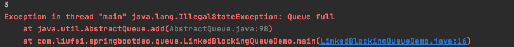

# 并发包

## 1. 计数器（CountDownLatch）

CountDownLatch 类位于java.util.concurrent包下，利用它可以实现类似计数器的功能。

**CountDownLatch这个类使一个线程等待其他线程各自执行完毕后再执行。**

比如有一个任务A，它要等待其他4个任务执行完毕之后才能执行，此时就可以利用CountDownLatch来实现这种功能了。CountDownLatch是通过一个计数器来实现的，计数器的初始值为线程的数量。每当一个线程完成了自己的任务后，计数器的值就会减1。当计数器值到达0时，它表示所有的线程已经完成了任务，然后在闭锁上等待的线程就可以恢复执行任务。

```java
public static void main(String[] args) throws InterruptedException {
//        ThreadPoolExecutor newFixedThreadPool = new ThreadPoolExecutor(20, 20,
//                0L, TimeUnit.MILLISECONDS,
//                new LinkedBlockingQueue<Runnable>());
        ThreadPoolExecutor newFixedThreadPool = new ThreadPoolExecutor(0, Integer.MAX_VALUE,
                60L, TimeUnit.MILLISECONDS,
                new SynchronousQueue<>());

        int size = 100;
  			// 线程不安全的
        final int[] count = {size};
        AtomicInteger integer = new AtomicInteger(size);
        CountDownLatch countDownLatch = new CountDownLatch(size);
        for (int i = 0; i < size; i++) {
            newFixedThreadPool.execute(new Runnable() {
                @Override
                public void run() {
                    try {
                        Thread.sleep(1000);
                    } catch (InterruptedException e) {
                        e.printStackTrace();
                    }
                    System.out.println(Thread.currentThread().getName() + ",子线程开始执行...");
                    integer.decrementAndGet();
                    countDownLatch.countDown();
                }
            });
        }
        countDownLatch.await();
        System.out.println("count:" + count[0]);
        System.out.println("AtomicInteger:" + integer.get());
        System.out.println("执行完成。..." + countDownLatch.getCount());
    }
```

结果：

```java
....
pool-1-thread-100,子线程开始执行...
pool-1-thread-99,子线程开始执行...
pool-1-thread-95,子线程开始执行...
pool-1-thread-96,子线程开始执行...
count:100
AtomicInteger:0
执行完成。...0
```

## 2. (屏障)CyclicBarrier

CyclicBarrier初始化时规定一个数目，然后计算调用了CyclicBarrier.await()进入等待的线程数。当线程数达到了这个数目时，所有进入等待状态的线程被唤醒并继续。 

CyclicBarrier就象它名字的意思一样，可看成是个障碍， 所有的线程必须到齐后才能一起通过这个障碍。 

CyclicBarrier初始时还可带一个Runnable的参数， 此Runnable任务在CyclicBarrier的数目达到后，所有其它线程被唤醒前被执行。

```java
public class CyclicBarrierTest {

    public static void main(String[] args) {
        CyclicBarrier cyclicBarrier=new CyclicBarrier(5);
        for (int i = 0; i < 5; i++) {
            Writer writer = new Writer(cyclicBarrier);
            new Thread(writer).start();
        }
    }
}

class Writer implements Runnable {

    private CyclicBarrier cyclicBarrier;

    public Writer(CyclicBarrier cyclicBarrier){
        this.cyclicBarrier=cyclicBarrier;
    }

    @Override
    public void run() {
        System.out.println("线程" + Thread.currentThread().getName() + ",正在写入数据");
        try {
            Thread.sleep(3000);
        } catch (Exception e) {
        }
        try {
            cyclicBarrier.await();
        } catch (Exception e) {
        }
        System.out.println("线程" + Thread.currentThread().getName() + ",写入数据成功.....");
    }
}
```

输出内容：

```java
线程Thread-0,正在写入数据
线程Thread-1,正在写入数据
线程Thread-2,正在写入数据
线程Thread-3,正在写入数据
线程Thread-4,正在写入数据
线程Thread-4,写入数据成功.....
线程Thread-2,写入数据成功.....
线程Thread-1,写入数据成功.....
线程Thread-0,写入数据成功.....
线程Thread-3,写入数据成功.....
```

## 3. CountDownLatch和CyclicBarrier区别：

1. CountDownLatch是一个计数器，线程完成一个记录一个，计数器递减，只能只用一次
2. CyclicBarrier的计数器更像一个阀门，需要所有线程都到达，然后继续执行，计数器递增，**提供reset功能，可以多次使用**

CyclicBarrier 使用场景
可以用于多线程计算数据，最后合并计算结果的场景。

## 阻塞队列与非阻塞队

### ConcurrentLinkedDeque

ConcurrentLinkedQueue : 是一个适用于高并发场景下的队列，通过无锁的方式，实现 了高并发状态下的高性能，通常ConcurrentLinkedQueue性能好于BlockingQueue.它 是一个基于链接节点的无界线程安全队列。

该队列的元素遵循先进先出的原则。头是最先 加入的，尾是最近加入的，该队列不允许null元素。 

ConcurrentLinkedQueue重要方法: 

> add 和offer() 都是加入元素的方法(在ConcurrentLinkedQueue中这俩个方法没有任何区别) 
>
> poll() 和peek() 都是取头元素节点，区别在于前者会删除元素，后者不会。
>

```java
ConcurrentLinkedQueue queue = new ConcurrentLinkedQueue();
queue.add("liufei");
queue.add("yiyang");
queue.offer("zhangsan");
// 从头获取，会删除元素
System.out.println(queue.poll());
// 从头获取，不会删除元素
System.out.println(queue.peek());
// 获取总长度
System.out.println(queue.size());
// 如果队列为空，会返回Null
System.out.println(queue.poll());
```

### BlockingQueue

阻塞队列（BlockingQueue）是一个支持两个附加操作的队列。这两个附加的操作是：

在队列为空时，获取元素的线程会等待队列变为非空。

当队列满时，存储元素的线程会等待队列可用。 

**队列不能添加null的元素**

阻塞队列常用于生产者和消费者的场景，生产者是往队列里添加元素的线程，消费者是从队列里拿元素的线程。阻塞队列就是生产者存放元素的容器，而消费者也只从容器里拿元素。

> BlockingQueue即阻塞队列，从阻塞这个词可以看出，在某些情况下对阻塞队列的访问可能会造成阻塞。被阻塞的情况主要有如下两种：
>
> 1. 当队列满了的时候进行入队列操作
>
> 2. 当队列空了的时候进行出队列操作
>
> 因此，当一个线程试图对一个已经满了的队列进行入队列操作时，它将会被阻塞，除非有另一个线程做了出队列操作；同样，当一个线程试图对一个空队列进行出队列操作时，它将会被阻塞，除非有另一个线程进行了入队列操作。

在Java中，BlockingQueue的接口位于java.util.concurrent 包中(在Java5版本开始提供)，由上面介绍的阻塞队列的特性可知，阻塞队列是线程安全的。

在新增的Concurrent包中，BlockingQueue很好的解决了多线程中，如何高效安全“传输”数据的问题。通过这些高效并且线程安全的队列类，为我们快速搭建高质量的多线程程序带来极大的便利。本文详细介绍了BlockingQueue家庭中的所有成员，包括他们各自的功能以及常见使用场景。

%accordion%认识BlockingQueue%accordion%

> 阻塞队列，顾名思义，首先它是一个队列，而一个队列在数据结构中所起的作用大致如下图所示：
>
> 从上图我们可以很清楚看到，通过一个共享的队列，可以使得数据由队列的一端输入，从另外一端输出；
>
> 常用的队列主要有以下两种：（当然通过不同的实现方式，还可以延伸出很多不同类型的队列，DelayQueue就是其中的一种）
>
> 　　先进先出（FIFO）：先插入的队列的元素也最先出队列，类似于排队的功能。从某种程度上来说这种队列也体现了一种公平性。
>
> 　　后进先出（LIFO）：后插入队列的元素最先出队列，这种队列优先处理最近发生的事件。
>
>    多线程环境中，通过队列可以很容易实现数据共享，比如经典的“生产者”和“消费者”模型中，通过队列可以很便利地实现两者之间的数据共享。假设我们有若干生产者线程，另外又有若干个消费者线程。如果生产者线程需要把准备好的数据共享给消费者线程，利用队列的方式来传递数据，就可以很方便地解决他们之间的数据共享问题。但如果生产者和消费者在某个时间段内，万一发生数据处理速度不匹配的情况呢？理想情况下，如果生产者产出数据的速度大于消费者消费的速度，并且当生产出来的数据累积到一定程度的时候，那么生产者必须暂停等待一下（阻塞生产者线程），以便等待消费者线程把累积的数据处理完毕，反之亦然。然而，在concurrent包发布以前，在多线程环境下，我们每个程序员都必须去自己控制这些细节，尤其还要兼顾效率和线程安全，而这会给我们的程序带来不小的复杂度。好在此时，强大的concurrent包横空出世了，而他也给我们带来了强大的BlockingQueue。（在多线程领域：所谓阻塞，在某些情况下会挂起线程（即阻塞），一旦条件满足，被挂起的线程又会自动被唤醒）
>

%/accordion%

#### ArrayBlockingQueue

ArrayBlockingQueue是一个有边界的阻塞队列，它的内部实现是一个数组。有边界的意思是它的容量是有限的，我们必须在其初始化的时候指定它的容量大小，容量大小一旦指定就不可改变。

ArrayBlockingQueue是以先进先出的方式存储数据，最新插入的对象是尾部，最新移出的对象是头部。下面是一个初始化和使用ArrayBlockingQueue的例子：

```java
ArrayBlockingQueue queue = new ArrayBlockingQueue(3);
queue.add("liufei");
queue.offer("yiyang");
queue.offer("zhangsan");
// 添加阻塞队列
queue.offer("lisi", 1, TimeUnit.SECONDS);
System.out.println(queue.size()); // 结果是3
```

#### LinkedBlockingQueue

LinkedBlockingQueue阻塞队列大小的配置是可选的，如果我们初始化时指定一个大小，它就是有边界的，如果不指定，它就是无边界的。说是无边界，其实是采用了默认大小为Integer.MAX_VALUE的容量 。它的内部实现是一个链表。

和ArrayBlockingQueue一样，LinkedBlockingQueue 也是以先进先出的方式存储数据，最新插入的对象是尾部，最新移出的对象是头部。下面是一个初始化和使LinkedBlockingQueue的例子：

```java
// 不能存null
LinkedBlockingQueue queue = new LinkedBlockingQueue();
queue.add("张三");
queue.add("李四");
queue.add("李四");
System.out.println(queue.size()); // 结果是3

LinkedBlockingQueue queue1 = new LinkedBlockingQueue(2);
queue1.add("张三");
queue1.add("李四");
queue1.add("李四");
System.out.println(queue1.size()); // 超出长度，会报错
```



#### PriorityBlockingQueue

PriorityBlockingQueue是一个没有边界的队列，它的排序规则和 java.util.PriorityQueue一样。需要注 

意，**PriorityBlockingQueue中不允许插入null对象。**

所有插入PriorityBlockingQueue的对象必须实现 java.lang.Comparable接口，队列优先级的排序规则就 

是按照我们对这个接口的实现来定义的。

另外，我们可以从PriorityBlockingQueue获得一个迭代器Iterator，但这个迭代器并不保证按照优先级顺 

序进行迭代。

下面我们举个例子来说明一下，首先我们定义一个对象类型，这个对象需要实现Comparable接口：

```java
public class User implements Comparable<User>{

    private String name;

    private Integer age;

    public String getName() {
        return name;
    }

    public void setName(String name) {
        this.name = name;
    }

    public Integer getAge() {
        return age;
    }

    public void setAge(Integer age) {
        this.age = age;
    }

    @Override
    public int compareTo(User o) {
      // 从小到大
        return this.age - o.age;
    }

    @Override
    public String toString() {
        return "User{" +
                "name='" + name + '\'' +
                ", age=" + age +
                '}';
    }
}
```

```java
PriorityBlockingQueue queue = new PriorityBlockingQueue();
queue.add("liufei");
queue.add("zhangsan");
queue.add("yiyang");
System.out.println(queue.size());

PriorityBlockingQueue queue2 = new PriorityBlockingQueue(2);
queue2.add("liufei");
queue2.add("zhangsan");
queue2.add("yiyang");
System.out.println(queue2.size()); // 结果是3。初始化大小，不能小于1

PriorityBlockingQueue queue1 = new PriorityBlockingQueue();
User user = new User();
user.setAge(21);
queue1.add(user);
User user1 = new User();
user1.setAge(20);
queue1.add(user1);
System.out.println(queue1.size());
System.out.println(queue1.poll());  // 输出的是age = 20的
```

#### SynchronousQueue

SynchronousQueue队列内部仅允许容纳一个元素。当一个线程插入一个元素后会被阻塞，除非这个元素被另一个线程消费。不能添加null元素。

```java
SynchronousQueue queue = new SynchronousQueue();
queue.add("liufei");
queue.add("zhangsan");
System.out.println(queue.size()); // 会报错 Exception in thread "main" java.lang.IllegalStateException: Queue full
```

### 使用BlockingQueue模拟生产者与消费者

```java
public class ProducerThread implements Runnable{

    private BlockingQueue<String> blockingDeque;

    private AtomicInteger count = new AtomicInteger();

    private volatile boolean FLAG = true;

    public ProducerThread(BlockingQueue<String> blockingQueue) {
        this.blockingDeque = blockingQueue;
    }

    @Override
    public void run() {
        System.out.println(Thread.currentThread().getName() + "生产者开始启动....");
        while (FLAG) {
            try {
                String data = count.incrementAndGet() + "";
                boolean offer = blockingDeque.offer(data, 2, TimeUnit.SECONDS);
                if (offer) {
                    System.out.println(Thread.currentThread().getName() + ",生产队列" + data + "成功..");
                } else {
                    System.out.println(Thread.currentThread().getName() + ",生产队列" + data + "失败..");
                }
                Thread.sleep(1000);
            } catch (Exception e) {
                e.printStackTrace();
            }
        }
        System.out.println(Thread.currentThread().getName() + ",生产者线程停止...");
    }

    public void stop () {
        this.FLAG = false;
    }
}
```

```java
public class ConsumerThread implements Runnable{

    private volatile boolean FLAG = true;

    private BlockingQueue<String> blockingQueue;

    public ConsumerThread(BlockingQueue<String> blockingQueue) {
        this.blockingQueue = blockingQueue;
    }

    @Override
    public void run() {
        System.out.println(Thread.currentThread().getName() + "消费者开始启动....");
        while (FLAG) {
            try {
                String data = blockingQueue.poll(2, TimeUnit.SECONDS);
                if (data == null || data == "") {
                    FLAG = false;
                    System.out.println("消费者超过2秒时间未获取到消息.");
                    return;
                }
                System.out.println("消费者获取到队列信息成功,data:" + data);
            } catch (Exception e) {
                // TODO: handle exception
            }
        }
    }
}
```

```java
public static void main(String[] args) {
        BlockingQueue<String> blockingQueue = new LinkedBlockingQueue<String>(3);
        ProducerThread producerThread = new ProducerThread(blockingQueue);
        ConsumerThread consumerThread = new ConsumerThread(blockingQueue);
        Thread t1 = new Thread(producerThread);
        Thread t2 = new Thread(consumerThread);
        t1.start();
        t2.start();

        //10秒后 停止线程..
        try {
            Thread.sleep(10*1000);
            producerThread.stop();
        } catch (Exception e) {
            // TODO: handle exception
        }
    }
```


# 线程池

## 1. 什么是线程池

Java中的线程池是运用场景最多的并发框架，几乎所有需要异步或并发执行任务的程序
都可以使用线程池。在开发过程中，合理地使用线程池能够带来3个好处。
第一：降低资源消耗。通过重复利用已创建的线程降低线程创建和销毁造成的消耗。
第二：提高响应速度。当任务到达时，任务可以不需要等到线程创建就能立即执行。
第三：提高线程的可管理性。线程是稀缺资源，如果无限制地创建，不仅会消耗系统资源，
还会降低系统的稳定性，使用线程池可以进行统一分配、调优和监控。但是，要做到合理利用
线程池，必须对其实现原理了如指掌。

## 2. 线程池的作用

线程池是为突然大量爆发的线程设计的，通过有限的几个固定线程为大量的操作服务，减少了创建和销毁线程所需的时间，从而提高效率。

**如果一个线程的时间非常长，就没必要用线程池了(不是不能作长时间操作，而是不宜。)，况且我们还不能控制线程池中线程的开始、挂起、和中止。**

## 3. 线程的分类

